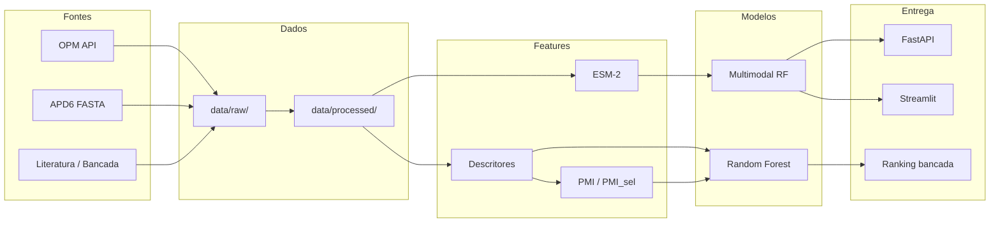

# PepMem-AI

Pipeline de inteligência artificial para **predição de interação peptídeo–membrana**, com foco na bioprospecção de peptídeos escorpiônicos (projeto CNPq / InovAI Lab — UFRN).

O sistema combina dados públicos (OPM, APD), descritores físico-químicos, embeddings **ESM-2**, o índice interpretável **PMI** (Peptide–Membrane Interaction) e modelos de machine learning para **priorizar candidatos** antes da validação experimental in vitro.

---

## Sumário

- [Contexto](#contexto)
- [Problema central](#problema-central)
- [Arquitetura](#arquitetura)
- [Fontes de dados](#fontes-de-dados)
- [Datasets gerados](#datasets-gerados)
- [Requisitos](#requisitos)
- [Instalação](#instalação)
- [Início rápido](#início-rápido)
- [Pipeline completo](#pipeline-completo)
- [Scripts disponíveis](#scripts-disponíveis)
- [Modelos de IA](#modelos-de-ia)
- [Explicabilidade (SHAP)](#explicabilidade-shap)
- [API REST (PoC)](#api-rest-poc)
- [Dashboard Streamlit (PoC)](#dashboard-streamlit-poc)
- [Peptídeos do projeto](#peptídeos-do-projeto)
- [Estrutura de diretórios](#estrutura-de-diretórios)
- [Limitações e próximos passos](#limitações-e-próximos-passos)
- [Referências](#referências)
- [Créditos](#créditos)

---

## Contexto

Peptídeos derivados de venenos de escorpiões (ex.: *Tityus stigmurus*) apresentam potencial **antimicrobiano, antiparasitário, antiviral e antitumoral**, em grande parte mediado pela interação com **membranas biológicas**. Testar experimentalmente todos os pares peptídeo × alvo é caro e lento.

O PepMem-AI formaliza o problema como:

> Dado um par **(peptídeo, membrana-alvo)**, prever a probabilidade ou intensidade de interação funcional (atividade, toxicidade, seletividade).

A saída mais útil para o laboratório é um **ranking de candidatos** para ensaios in vitro, fechando um ciclo de *active learning* quando novos dados experimentais são incorporados.

---

## Problema central

```
f(peptídeo, membrana) → y
```

| Entrada | Descrição |
|---------|-----------|
| **Peptídeo** | Sequência + descritores (carga, hidrofobicidade, momento hidrofóbico) + embedding ESM-2 |
| **Membrana** | Tipo (Gram+, Gram-, fungo, vírus, célula normal/tumoral) + descritores (carga, LPS, colesterol, ergosterol…) |
| **Saída `y`** | MIC, IC50, CC50, classe de atividade, score de interação ou ranking |

**Índice de seletividade (conceitual):**

```
PMI_sel = PMI_alvo_patológico − PMI_célula_normal
```

---

## Arquitetura



**Fluxo operacional:**

1. Coleta e curadoria (OPM, APD, peptídeos do projeto)
2. Representação peptídeo + membrana
3. Construção de pares com PMI
4. Embeddings ESM-2
5. Treinamento baseline / multimodal
6. Ranking → validação in vitro → realimentação da base

---

## Fontes de dados

| Fonte | Conteúdo | Como obtemos |
|-------|----------|--------------|
| **[OPM](https://opm.phar.umich.edu/)** | Proteínas e tipos de membrana (8.950 estruturas, 24 membranas) | API REST (`scripts/download_opm.py`) |
| **[APD6](https://aps.unmc.edu/downloads)** | 3.306 peptídeos antimicrobianos naturais (FASTA 2024) | Download direto (`scripts/download_apd.py`) |
| **Projeto CNPq** | Análogos Stigmurina / TsAP-2 | `pepmem_base_project` |
| **Parente 2022** | StigA6, StigA16 + MIC/MBC (cepas MDR) | `pepmem_endpoints` (literatura) |
| **CAMP** | AMPs com MIC (24k+) | *Pendente* — site sem bulk download público |

---

## Datasets gerados

Arquivos principais em `data/processed/`:

| Arquivo | Linhas | Descrição |
|---------|--------|-----------|
| `pepmem_base.parquet` | 3.316 | Projeto (12) + APD (3.304), deduplicados por sequência |
| `pepmem_base_project.parquet` | 12 | Peptídeos escorpiônicos do projeto |
| `pepmem_base_apd.parquet` | 3.304 | Peptídeos naturais do APD6 |
| `membrane_targets.parquet` | 34 | 24 membranas OPM + 10 alvos experimentais |
| `pepmem_endpoints.parquet` | 144 | Scaffold + 24 endpoints da literatura (MIC/MBC) |
| `pepmem_pairs.parquet` | 192 | Pares peptídeo–membrana com PMI e MIC quando disponível |
| `embeddings/esm2_all.npz` | 3.316 × 320 | Embeddings ESM-2 (`facebook/esm2_t6_8M_UR50D`) |
| `models/multimodal_mic_rf.joblib` | — | Modelo multimodal treinado |
| `models/project_ranking_baseline.csv` | — | Ranking pré-calculado do projeto |

### Schema — `pepmem_pairs`

| Coluna | Descrição |
|--------|-----------|
| `peptide_id`, `sequence` | Identificação do peptídeo |
| `target_id`, `target`, `target_type` | Membrana-alvo |
| `q_peptide`, `h_peptide`, `mu_h_peptide` | Descritores do peptídeo |
| `surface_charge`, `anionic_fraction`, `lps`, … | Descritores da membrana |
| `pmi`, `pmi_sel` | Índice de interação e seletividade |
| `mic_value`, `mbc_value` | Endpoints experimentais (quando existem) |

---

## Requisitos

- **Python** 3.10+
- **RAM** ≥ 8 GB (embeddings ESM-2 em CPU)
- **GPU** opcional (acelera inferência ESM-2)
- Conexão com internet na primeira execução (download Hugging Face / APD / OPM)

---

## Instalação

```bash
git clone <url-do-repositorio>
cd PepMem-AI

python3 -m venv .venv
source .venv/bin/activate   # Linux/macOS
# .venv\Scripts\activate   # Windows

pip install -r requirements.txt
```

> Na primeira inferência, o modelo ESM-2 (~30 MB) é baixado automaticamente do Hugging Face.

---

## Início rápido

### 1. Baixar dados brutos (se ainda não existirem)

```bash
python scripts/download_opm.py    # ~3 min — API paginada
python scripts/download_apd.py    # ~10 s — FASTA APD6
```

### 2. Construir datasets e treinar modelos

```bash
python scripts/run_pipeline.py
```

Ou passo a passo:

```bash
python scripts/build_datasets.py
python scripts/build_pairs.py
python scripts/generate_embeddings.py --scope all
python scripts/train_baseline.py
python scripts/train_multimodal.py
```

### 3. Subir API e dashboard

```bash
# Terminal 1 — API (porta 8001 recomendada)
PYTHONPATH=. uvicorn api.main:app --reload --host 0.0.0.0 --port 8001

# Terminal 2 — Dashboard
PYTHONPATH=. streamlit run dashboard/app.py
```

- **Swagger:** http://localhost:8001/docs  
- **Streamlit:** http://localhost:8501  

---

## Pipeline completo

`scripts/run_pipeline.py` executa sequencialmente:

| Etapa | Script | Produto |
|-------|--------|---------|
| 1 | `build_datasets.py` | CSV/Parquet curados |
| 2 | `build_pairs.py` | Pares com PMI |
| 3 | `generate_embeddings.py` | `esm2_all.npz` |
| 4 | `train_baseline.py` | RF clássico + ranking |
| 5 | `train_multimodal.py` | RF + ESM-2 |
| 6 | `compute_shap.py` | Importância SHAP global (JSON) |

---

## Scripts disponíveis

| Script | Função |
|--------|--------|
| `download_opm.py` | Download completo OPM via API REST |
| `download_apd.py` | Download listas FASTA APD6 |
| `build_datasets.py` | Monta PepMem-Base, Membrane-Targets, Endpoints |
| `build_pairs.py` | Pares peptídeo–membrana + PMI + MIC |
| `generate_embeddings.py` | Embeddings ESM-2 (`--scope project\|all`) |
| `train_baseline.py` | Random Forest (11 features clássicas) |
| `train_multimodal.py` | Random Forest (331 features: clássicas + ESM-2) |
| `compute_shap.py` | SHAP TreeExplainer — relatórios globais JSON |
| `run_pipeline.py` | Orquestra todo o fluxo acima |
| `peptide_utils.py` | Parsing FASTA, descritores, normalização |
| `pmi.py` | Cálculo PMI / PMI_sel |

### Biblioteca Python — `pepmem/`

```python
from pepmem import PepMemPredictor

predictor = PepMemPredictor(use_embeddings=True)

# Predição para um par
result = predictor.predict_pair(
    sequence="FFSLIPKLVKGLISAFK",  # StigA6
    target_id="S_aureus_ATCC29213",
    net_charge=3,
)
print(result["pmi"], result["pred_high_activity_prob"])

# Ranking multi-alvo
df = predictor.rank_peptide("FFSLIPKLVKGLISAFK", net_charge=3)

# Explicação SHAP (local)
explanation = predictor.explain_pair(
    sequence="FFSLIPKLVKGLISAFK",
    target_id="S_aureus_ATCC29213",
    net_charge=3,
)
print(explanation["shap_contributions"][:3])
```

---

## Modelos de IA

### Baseline (`baseline_mic_rf.joblib`)

- **Features:** 11 descritores clássicos + PMI
- **Treino:** 12 MICs experimentais (StigA6/StigA16 × 6 cepas MDR)
- **Rótulo:** alta atividade se MIC ≤ 3,4 µM
- **Validação:** Leave-One-Out (LOO) AUC ≈ **0,75**

### Multimodal (`multimodal_mic_rf.joblib`)

- **Features:** 11 clássicas + **320 dimensões ESM-2**
- **Modelo:** Random Forest (300 árvores, `max_depth=6`)
- **LOO AUC ≈ 0,875** (amostra pequena — resultado preliminar)

> **Atenção:** com apenas 12 amostras rotuladas, as probabilidades do modelo podem ser instáveis. Use **PMI_sel** e **final_score** como critérios complementares até a incorporação de mais dados da bancada.

### PMI (Peptide–Membrane Interaction Index)

```
PMI = α·Qp·|Qm| + β·Hp·Hm + γ·μHp − δ·Colesterol_m
```

Pesos padrão: α=1,0 · β=0,5 · γ=0,3 · δ=0,4 (ajustáveis empiricamente).

---

## Explicabilidade (SHAP)

O projeto usa **SHAP TreeExplainer** sobre o Random Forest para explicar *por que* o modelo atribui uma probabilidade de alta atividade a um par peptídeo–membrana.

| Onde | Como |
|------|------|
| **Dashboard** | Aba **XAI (SHAP)** ou expander na aba Predição |
| **API** | `POST /explain` (local) · `GET /explain/global` |
| **Script** | `python scripts/compute_shap.py` (importância global) |

**Features interpretáveis:** carga do peptídeo, hidrofobicidade, PMI, descritores da membrana (LPS, peptidoglicano, colesterol…). No modelo multimodal, as 320 dimensões ESM-2 são **agregadas** em um único termo “ESM-2 (embedding agregado)” no gráfico.

```bash
# Após treino
python scripts/compute_shap.py

# Explicação via API
curl -X POST http://localhost:8001/explain \
  -H "Content-Type: application/json" \
  -d '{"sequence":"FFSLIPSLVGGLISAFK","target_id":"E_coli_ATCC25922","net_charge":3}'
```

Arquivos gerados: `data/processed/models/shap_global_baseline.json`, `shap_global_multimodal.json`, `shap_beeswarm_baseline.png`, `shap_beeswarm_multimodal.png`.

No dashboard, a aba **XAI (SHAP)** inclui o **beeswarm** clássico (um ponto por amostra MIC, cor = valor do descritor).

---

## API REST (PoC)

Base URL: `http://localhost:8001`

| Método | Rota | Descrição |
|--------|------|-----------|
| `GET` | `/health` | Status e carregamento do modelo |
| `GET` | `/targets` | Lista de membranas-alvo |
| `GET` | `/model/info` | Métricas do modelo treinado |
| `POST` | `/predict` | Predição para um par |
| `POST` | `/explain` | Explicação SHAP local (contribuição por feature) |
| `GET` | `/explain/global` | Importância SHAP média no conjunto MIC |
| `POST` | `/rank` | Ranking multi-alvo |

### Exemplo — predição

```bash
curl -X POST http://localhost:8001/predict \
  -H "Content-Type: application/json" \
  -d '{
    "sequence": "FFSLIPKLVKGLISAFK",
    "target_id": "S_aureus_ATCC29213",
    "net_charge": 3
  }'
```

### Exemplo — ranking

```bash
curl -X POST http://localhost:8001/rank \
  -H "Content-Type: application/json" \
  -d '{
    "sequence": "FFSLIPKLVKGLISAFK",
    "net_charge": 3,
    "lambda_tox": 0.5
  }'
```

**Corpo (`/rank`):**

| Campo | Tipo | Obrigatório | Descrição |
|-------|------|-------------|-----------|
| `sequence` | string | sim | Sequência peptídica (5–200 aa) |
| `target_ids` | list[str] | não | Subconjunto de alvos; omitir = todos |
| `net_charge` | float | não | Carga líquida manual |
| `lambda_tox` | float | não | Penalização de toxicidade (padrão 0,5) |

**Score final (ranking):**

```
final_score = pred_atividade − λ·pred_tox_célula_normal + bônus_PMI_sel
```

---

## Dashboard Streamlit (PoC)

```bash
PYTHONPATH=. streamlit run dashboard/app.py
```

Abas:

| Aba | Função |
|-----|--------|
| **Predição** | Um par peptídeo × membrana com PMI e probabilidade |
| **Ranking** | Ordenação por alvo + gráfico de scores |
| **Datasets** | Estatísticas e tabela dos peptídeos do projeto |
| **API** | Documentação e exemplos curl |

---

## Peptídeos do projeto

| ID | Nome | Sequência | Origem |
|----|------|-----------|--------|
| P10 | Stigmurin nativo | `FFSLIPSLVGGLISAFK` | APD AP02531 / CNPq |
| P11 | StigA6 | `FFSLIPKLVKGLISAFK` | Parente 2022 |
| P12 | StigA16 | `FFKLIPKLVKGLISAFK` | Parente 2022 |
| P01–P09 | Análogos Stigmurina / TsAP-2 | ver `pepmem_base_project.csv` | CNPq / patentes INPI |

**Alvos experimentais (validação in vitro):**

- Gram+: *S. aureus*, *S. epidermidis*
- Gram−: *E. coli*, *P. aeruginosa*
- Fungo: *Candida* spp.
- Parasita: *Trypanosoma cruzi*
- Vírus: Zika PE243, HSV-1
- Citotoxicidade: célula normal vs tumoral

---

## Estrutura de diretórios

```
PepMem-AI/
├── README.md
├── requirements.txt
├── dataset_list.txt              # Link OPM
├── PepMem_AI_Pipeline_*.tex      # Documentação científica (slides)
│
├── pepmem/                       # Biblioteca de inferência
│   ├── __init__.py
│   ├── predictor.py              # PepMemPredictor
│   └── features.py               # Engenharia de features
│
├── api/
│   └── main.py                   # FastAPI
│
├── dashboard/
│   └── app.py                    # Streamlit PoC
│
├── scripts/
│   ├── download_opm.py
│   ├── download_apd.py
│   ├── build_datasets.py
│   ├── build_pairs.py
│   ├── generate_embeddings.py
│   ├── train_baseline.py
│   ├── train_multimodal.py
│   ├── run_pipeline.py
│   ├── peptide_utils.py
│   └── pmi.py
│
└── data/
    ├── raw/
    │   ├── opm/                  # JSON da API OPM
    │   └── apd/                  # FASTA APD6
    └── processed/
        ├── pepmem_base*.parquet
        ├── membrane_targets.parquet
        ├── pepmem_endpoints.parquet
        ├── pepmem_pairs.parquet
        ├── embeddings/
        │   └── esm2_all.npz
        └── models/
            ├── baseline_mic_rf.joblib
            ├── multimodal_mic_rf.joblib
            └── project_ranking_baseline.csv
```

---

## Deploy gratuito (colaboradores)

Para publicar o dashboard online e compartilhar um link, siga o guia **[DEPLOY.md](DEPLOY.md)**.

**Deploy em 2 comandos** (após criar repo GitHub e token HF):

```bash
./scripts/deploy_github.sh SEU_USUARIO GitHub && git push -u origin main
hf auth login && python scripts/deploy_hf_space.py SEU_USUARIO_HF
```

| Plataforma | Custo | Melhor para |
|------------|-------|-------------|
| [Hugging Face Spaces](https://huggingface.co/spaces) | Grátis | ML + link estável (**recomendado**) |
| [Streamlit Cloud](https://share.streamlit.io) | Grátis | Deploy rápido se o repo já estiver no GitHub |
| [Render](https://render.com) | Grátis (com sleep) | Docker; `Dockerfile` e `render.yaml` inclusos |

Arquivo principal do dashboard: `dashboard/app.py`. Dados necessários: pasta `data/processed/` (~8 MB).

---

## Limitações e próximos passos

| Limitação | Próximo passo |
|-----------|---------------|
| Apenas 12 MICs rotulados | Incorporar MICs do APD/literatura e dados da bancada |
| CAMP não integrado | Scraping paginado ou dados suplementares CAMPR4 |
| Modelo RF simples | Encoder multimodal PyTorch (ProtBERT + MLP membrana) |
| Sem teste externo robusto | Split por cluster de sequência + teste prospectivo |
| Probabilidades instáveis | Calibrar com mais dados; priorizar PMI_sel no ranking |
| Endpoints limitados a MIC | IC50, CC50, EC50, SI multitarefa |

**Roadmap sugerido:**

1. Curto prazo — enriquecer `pepmem_endpoints` com literatura
2. Médio prazo — modelo multimodal PyTorch; ~~XAI (SHAP)~~ **SHAP integrado** (RF + dashboard)
3. Longo prazo — validação experimental + *active learning* + publicação do dataset (Zenodo/DOI)

---

## Referências

- Wang et al. (2016). **APD3** — Antimicrobial Peptide Database. *Nucleic Acids Research*.
- Lomize et al. **OPM** — Orientation of Proteins in Membranes. [opm.phar.umich.edu](https://opm.phar.umich.edu/)
- Lin et al. **ESM-2** — Evolutionary scale modeling. *Science* (2023).
- Parente (2022). *Structural evaluation and antimicrobial activity of analog peptides from Stigmurin*. UFRN.
- Lee et al. (2016). Mapping membrane activity with machine learning. *PNAS*.
- Documentação interna: `PepMem_AI_Pipeline_LaTeX_InovAI_entregaveis_logo_v9.tex`

---

## Créditos

- **InovAI Lab** / **LANCE** — IMD/UFRN  
- **Prof. Marcelo A. C. Fernandes** — pipeline computacional  
- **Dra. Allanny Alves Furtado / Prof. Matheus Pedrosa** — projeto CNPq de bioprospecção  
- **Dra. Adriana Parente** — dados StigA6/StigA16 (tese 2022)

---

## Licença de dados de terceiros

- **OPM:** [University of Michigan](https://opm.phar.umich.edu/) — citar ao usar os dados.
- **APD6:** [aps.unmc.edu](https://aps.unmc.edu/) — citar APD3/APD6 em publicações.
- **ESM-2:** Meta AI / Hugging Face — ver licença do modelo `facebook/esm2_t6_8M_UR50D`.
