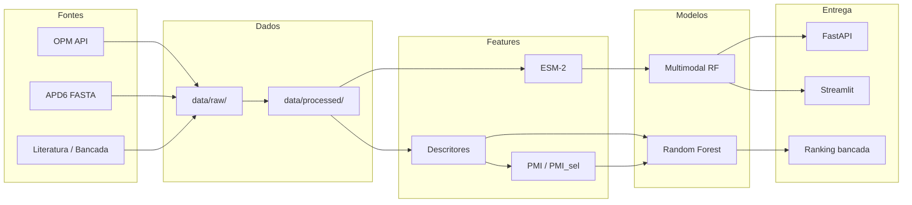

# PepMem-AI

Pipeline de inteligência artificial para **predição de interação peptídeo–membrana**, com foco na bioprospecção de peptídeos escorpiônicos (projeto CNPq / InovAI Lab — UFRN).

O sistema combina dados públicos (OPM, APD), descritores físico-químicos, embeddings **ESM-2**, o índice interpretável **PMI** (Peptide–Membrane Interaction) e modelos de machine learning para **priorizar candidatos** antes da validação experimental in vitro.

---

## Sumário

- [Contexto](#contexto)
- [Problema central](#problema-central)
- [Arquitetura](#arquitetura)
- [Fontes de dados](#fontes-de-dados)
- [Datasets gerados](#datasets-gerados)
- [Requisitos](#requisitos)
- [Instalação](#instalação)
- [Início rápido](#início-rápido)
- [Pipeline completo](#pipeline-completo)
- [Scripts disponíveis](#scripts-disponíveis)
- [Modelos de IA](#modelos-de-ia)
- [Explicabilidade (SHAP)](#explicabilidade-shap)
- [API REST (PoC)](#api-rest-poc)
- [Dashboard Streamlit](#dashboard-streamlit-poc)
- [Documentação](#documentação)
- [Peptídeos do projeto](#peptídeos-do-projeto)
- [Estrutura de diretórios](#estrutura-de-diretórios)
- [Deploy](#deploy-gratuito-colaboradores)
- [Limitações e próximos passos](#limitações-e-próximos-passos)
- [Referências](#referências)
- [Créditos](#créditos)

---

## Contexto

Peptídeos derivados de venenos de escorpiões (ex.: *Tityus stigmurus*) apresentam potencial **antimicrobiano, antiparasitário, antiviral e antitumoral**, em grande parte mediado pela interação com **membranas biológicas**. Testar experimentalmente todos os pares peptídeo × alvo é caro e lento.

O PepMem-AI formaliza o problema como:

> Dado um par **(peptídeo, membrana-alvo)**, prever a probabilidade ou intensidade de interação funcional (atividade, toxicidade, seletividade).

A saída mais útil para o laboratório é um **ranking de candidatos** para ensaios in vitro, fechando um ciclo de *active learning* quando novos dados experimentais são incorporados.

---

## Problema central

```
f(peptídeo, membrana) → y
```

| Entrada | Descrição |
|---------|-----------|
| **Peptídeo** | Sequência + descritores (carga, hidrofobicidade, momento hidrofóbico) + embedding ESM-2 |
| **Membrana** | Tipo (Gram+, Gram-, fungo, vírus, célula normal/tumoral) + descritores (carga, LPS, colesterol, ergosterol…) |
| **Saída `y`** | MIC, IC50, CC50, classe de atividade, score de interação ou ranking |

**Índice de seletividade (conceitual):**

```
PMI_sel = PMI_alvo_patológico − PMI_célula_normal
```

---

## Arquitetura


```mermaid
flowchart LR
    subgraph Fontes
        OPM[OPM API]
        APD[APD6 FASTA]
        LIT[Literatura / Bancada]
    end

    subgraph Dados
        RAW[data/raw/]
        PROC[data/processed/]
    end

    subgraph Features
        DESC[Descritores]
        ESM[ESM-2]
        PMI[PMI / PMI_sel]
    end

    subgraph Modelos
        RF[Random Forest]
        MM[Multimodal RF]
    end

    subgraph Entrega
        API[FastAPI]
        UI[Streamlit]
        RANK[Ranking bancada]
    end

    OPM --> RAW
    APD --> RAW
    LIT --> RAW
    RAW --> PROC
    PROC --> DESC
    PROC --> ESM
    DESC --> PMI
    DESC --> RF
    ESM --> MM
    PMI --> RF
    MM --> API
    MM --> UI
    RF --> RANK
```

**Fluxo operacional:**

1. Coleta e curadoria (OPM, APD, peptídeos do projeto)
2. Representação peptídeo + membrana
3. Construção de pares com PMI
4. Embeddings ESM-2
5. Treinamento baseline / multimodal
6. Ranking → validação in vitro → realimentação da base

---

## Fontes de dados

| Fonte | Conteúdo | Como obtemos |
|-------|----------|--------------|
| **[OPM](https://opm.phar.umich.edu/)** | Proteínas e tipos de membrana (8.950 estruturas, 24 membranas) | API REST (`scripts/download_opm.py`) |
| **[APD6](https://aps.unmc.edu/downloads)** | 3.306 peptídeos antimicrobianos naturais (FASTA 2024) | Download direto (`scripts/download_apd.py`) |
| **Projeto CNPq** | Análogos Stigmurina / TsAP-2 (P01–P18) | `pepmem_base_project` |
| **Parente 2022** | StigA6, StigA16 + MIC/MBC (cepas MDR) | `pepmem_endpoints` (literatura) |
| **Literatura do grupo** | MICs ATCC/clínicos (Stigmurin, StigA*, TsAP-2*) | `data/bench/` → import |
| **CAMP** | AMPs com MIC (24k+) | *Pendente* — site sem bulk download público |

---

## Datasets gerados

Arquivos principais em `data/processed/`:

| Arquivo | Linhas | Descrição |
|---------|--------|-----------|
| `pepmem_base.parquet` | 3.322 | Projeto (18) + APD (3.304), deduplicados por sequência |
| `pepmem_base_project.parquet` | 18 | Peptídeos escorpiônicos do projeto (P01–P18) |
| `pepmem_base_apd.parquet` | 3.304 | Peptídeos naturais do APD6 |
| `membrane_targets.parquet` | 34+ | Membranas OPM + alvos experimentais (+ bancada) |
| `pepmem_endpoints.parquet` | 282 | Scaffold + 24 literatura + 78 bancada (MIC) |
| `pepmem_pairs.parquet` | 432 | Pares peptídeo–membrana com PMI (**90** com MIC) |
| `embeddings/esm2_all.npz` | 3.322 × 320 | Embeddings ESM-2 (`facebook/esm2_t6_8M_UR50D`) |
| `models/multimodal_mic_rf.joblib` | — | Modelo multimodal treinado |
| `models/project_ranking_baseline.csv` | — | Ranking pré-calculado do projeto |

### Schema — `pepmem_pairs`

| Coluna | Descrição |
|--------|-----------|
| `peptide_id`, `sequence` | Identificação do peptídeo |
| `target_id`, `target`, `target_type` | Membrana-alvo |
| `q_peptide`, `h_peptide`, `mu_h_peptide` | Descritores do peptídeo |
| `surface_charge`, `anionic_fraction`, `lps`, … | Descritores da membrana |
| `pmi`, `pmi_sel` | Índice de interação e seletividade |
| `mic_value`, `mbc_value` | Endpoints experimentais (quando existem) |

---

## Requisitos

- **Python** 3.10+
- **RAM** ≥ 8 GB (embeddings ESM-2 em CPU)
- **GPU** opcional (acelera inferência ESM-2)
- Conexão com internet na primeira execução (download Hugging Face / APD / OPM)

---

## Instalação

```bash
git clone https://github.com/gbmotta/PepMem-AI.git
cd PepMem-AI

python3 -m venv .venv
source .venv/bin/activate   # Linux/macOS
# .venv\Scripts\activate   # Windows
```

| Perfil | Comando | Uso |
|--------|---------|-----|
| **Cloud / dashboard leve** | `pip install -r requirements.txt` | Streamlit Cloud, Render (sem PyTorch) |
| **Space / multimodal** | `pip install -r requirements-space.txt` | ESM-2 + torch CPU (`-r requirements.txt` + extras) |
| **Dev + API** | `pip install -r requirements-dev.txt` | Space + FastAPI |

> Na primeira inferência **multimodal**, o ESM-2 (`facebook/esm2_t6_8M_UR50D`) baixa do Hugging Face.  
> No Cloud leve o app usa só o **baseline** (clássicas + PMI).

---

## Início rápido

### 1. Baixar dados brutos (se ainda não existirem)

```bash
python scripts/download_opm.py    # ~3 min — API paginada
python scripts/download_apd.py    # ~10 s — FASTA APD6
```

### 2. Construir datasets e treinar modelos

```bash
python scripts/run_pipeline.py
```

Ou passo a passo:

```bash
python scripts/build_datasets.py
python scripts/build_pairs.py
python scripts/generate_embeddings.py --scope all
python scripts/train_baseline.py
python scripts/train_multimodal.py
```

### 3. Subir API e dashboard

```bash
# Terminal 1 — API (porta 8001 recomendada)
PYTHONPATH=. uvicorn api.main:app --reload --host 0.0.0.0 --port 8001

# Terminal 2 — Dashboard
PYTHONPATH=. streamlit run dashboard/app.py
```

- **Swagger:** http://localhost:8001/docs  
- **Streamlit:** http://localhost:8501  

---

## Pipeline completo

`scripts/run_pipeline.py` executa sequencialmente:

| Etapa | Script | Produto |
|-------|--------|---------|
| 1 | `build_datasets.py` | CSV/Parquet curados |
| 2 | `build_pairs.py` | Pares com PMI |
| 3 | `generate_embeddings.py` | `esm2_all.npz` |
| 4 | `train_baseline.py` | RF clássico + ranking |
| 5 | `train_multimodal.py` | RF + ESM-2 |
| 6 | `compute_shap.py` | Importância SHAP global (JSON) |

---

## Scripts disponíveis

| Script | Função |
|--------|--------|
| `download_opm.py` | Download completo OPM via API REST |
| `download_apd.py` | Download listas FASTA APD6 |
| `build_datasets.py` | Monta PepMem-Base, Membrane-Targets, Endpoints |
| `build_pairs.py` | Pares peptídeo–membrana + PMI + MIC |
| `generate_embeddings.py` | Embeddings ESM-2 (`--scope project\|all`, `--missing-only`) |
| `train_baseline.py` | Random Forest (11 features clássicas) |
| `train_multimodal.py` | Random Forest (331 features: clássicas + ESM-2) |
| `compute_shap.py` | SHAP TreeExplainer — relatórios globais JSON |
| `bench_mic.py` | Validação/carga da planilha de bancada (lib) |
| `import_bench_mic.py` | Importa MICs (`data/bench/`) + rebuild + retreino opcional |
| `run_pipeline.py` | Orquestra todo o fluxo acima |
| `deploy_hf_space.py` / `deploy_github.sh` | Publicação HF Spaces / GitHub |
| `pepmem/peptide_utils.py` | Parsing FASTA, descritores, normalização |
| `pepmem/pmi.py` | Índice PMI e seletividade |

### Biblioteca Python — `pepmem/`

```python
from pepmem import PepMemPredictor

predictor = PepMemPredictor(use_embeddings=True)

# Predição para um par
result = predictor.predict_pair(
    sequence="FFSLIPKLVKGLISAFK",  # StigA6
    target_id="S_aureus_ATCC29213",
    net_charge=3,
)
print(result["pmi"], result["pred_high_activity_prob"])

# Ranking multi-alvo
df = predictor.rank_peptide("FFSLIPKLVKGLISAFK", net_charge=3)

# Explicação SHAP (local)
explanation = predictor.explain_pair(
    sequence="FFSLIPKLVKGLISAFK",
    target_id="S_aureus_ATCC29213",
    net_charge=3,
)
print(explanation["shap_contributions"][:3])
```

---

## Modelos de IA

### Baseline (`baseline_mic_rf.joblib`)

- **Features:** 11 descritores clássicos + PMI  
- **Treino:** ~90 pares MIC (literatura + bancada)  
- **Rótulo:** alta atividade se MIC ≤ 3,4 µM  
- **Validação principal:** leave-one-**peptide**-out (LOPO) — AUC tipicamente ~0,87–0,88  
- **Deploy Cloud:** este é o modelo ativo (sem PyTorch)

### Multimodal (`multimodal_mic_rf.joblib`)

- **Features:** clássicas + **embedding ESM-2** (~320 dims, mean-pool)  
- **Modelo de linguagem:** `facebook/esm2_t6_8M_UR50D` (variante leve)  
- **Por quê ESM-2:** representação de sequência sem estrutura 3D; complementa PMI; cabe em CPU/Space  
- **Deploy:** Hugging Face Space / local com `requirements-space.txt`

> Use **PMI_sel**, intervalo entre árvores e vizinhos junto com a probabilidade calibrada.

### PMI (Peptide–Membrane Interaction Index)

```
PMI = α·Qp·|Qm| + β·Hp·Hm + γ·μHp − δ·Colesterol_m
```

Pesos padrão: α=1,0 · β=0,5 · γ=0,3 · δ=0,4 (ajustáveis empiricamente).

---

## Explicabilidade (SHAP)

**SHAP TreeExplainer** atribui a cada descritor uma contribuição para a classe “alta atividade”.

| Onde | Como |
|------|------|
| **Dashboard** | Aba **XAI** (texto didático + global/beeswarm/local) e bloco SHAP na Predição |
| **API** | `POST /explain` · `GET /explain/global` |
| **Script** | `python scripts/compute_shap.py` |

No multimodal, as dims ESM-2 aparecem agregadas como **“ESM-2 (embedding agregado)”**. Guia de leitura: [`docs/INTERPRETACAO_RESULTADOS.md`](docs/INTERPRETACAO_RESULTADOS.md).

Arquivos gerados: `data/processed/models/shap_global_baseline.json`, `shap_global_multimodal.json`, `shap_beeswarm_baseline.png`, `shap_beeswarm_multimodal.png`.

No dashboard, a aba **XAI (SHAP)** inclui o **beeswarm** clássico (um ponto por amostra MIC, cor = valor do descritor).

---

## API REST (PoC)

Base URL: `http://localhost:8001`

| Método | Rota | Descrição |
|--------|------|-----------|
| `GET` | `/health` | Status e carregamento do modelo |
| `GET` | `/targets` | Lista de membranas-alvo |
| `GET` | `/model/info` | Métricas do modelo treinado |
| `POST` | `/predict` | Predição para um par |
| `POST` | `/explain` | Explicação SHAP local (contribuição por feature) |
| `GET` | `/explain/global` | Importância SHAP média no conjunto MIC |
| `POST` | `/rank` | Ranking multi-alvo |

### Exemplo — predição

```bash
curl -X POST http://localhost:8001/predict \
  -H "Content-Type: application/json" \
  -d '{
    "sequence": "FFSLIPKLVKGLISAFK",
    "target_id": "S_aureus_ATCC29213",
    "net_charge": 3
  }'
```

### Exemplo — ranking

```bash
curl -X POST http://localhost:8001/rank \
  -H "Content-Type: application/json" \
  -d '{
    "sequence": "FFSLIPKLVKGLISAFK",
    "net_charge": 3,
    "lambda_tox": 0.5
  }'
```

**Corpo (`/rank`):**

| Campo | Tipo | Obrigatório | Descrição |
|-------|------|-------------|-----------|
| `sequence` | string | sim | Sequência peptídica (5–200 aa) |
| `target_ids` | list[str] | não | Subconjunto de alvos; omitir = todos |
| `net_charge` | float | não | Carga líquida manual |
| `lambda_tox` | float | não | Penalização de toxicidade (padrão 0,5) |

**Score final (ranking):**

```
final_score = pred_atividade − λ·pred_tox_célula_normal + bônus_PMI_sel
```

---

## Dashboard Streamlit (PoC)

```bash
# Leve (Cloud) ou space (multimodal)
pip install -r requirements.txt          # ou requirements-space.txt
PYTHONPATH=. streamlit run dashboard/app.py
```

| Aba | Função |
|-----|--------|
| **Predição** | Par único ou **lote** (multi-FASTA / vários arquivos) · PMI · prob. calibrada · vizinhos · SHAP local · explicação em português · relatório **MD / DOCX / PDF** |
| **Ranking** | Mesmo peptídeo × vários alvos · score com λ · explicação · relatório |
| **XAI (SHAP)** | Importância global, beeswarm, SHAP local · textos sobre SHAP e **ESM-2** · relatório |
| **Datasets** | KPIs e peptídeos do projeto |
| **API** | Endpoints FastAPI (uso local) |

Sidebar: guia de faixas (≥70% / intermediário / baixa), atalho de exemplo, última predição.

### Deploy (Streamlit Community Cloud)

1. Repo: [gbmotta/PepMem-AI](https://github.com/gbmotta/PepMem-AI)
2. [share.streamlit.io](https://share.streamlit.io) → **New app**
3. **Main file:** `dashboard/app.py` · **Branch:** `main` · **Python:** 3.11
4. Usa `requirements.txt` (leve). Multimodal completo: [Space HF](https://huggingface.co/spaces/gbmotta/pepmem-ai)

Guia completo: [`docs/DEPLOY.md`](docs/DEPLOY.md).

---

## Documentação

| Doc | Conteúdo |
|-----|----------|
| [`docs/DEPLOY.md`](docs/DEPLOY.md) | Publicar (HF Spaces, Streamlit Cloud, Render) |
| [`docs/TREINO.md`](docs/TREINO.md) | Dados, LOPO, calibração, artefatos |
| [`docs/INTERPRETACAO_RESULTADOS.md`](docs/INTERPRETACAO_RESULTADOS.md) | Como ler PMI, prob., ranking, SHAP |
| [`docs/README.md`](docs/README.md) | Índice da pasta `docs/` |
| [`data/bench/README.md`](data/bench/README.md) | Planilha de MICs da bancada |
| [`deploy/README_HF.md`](deploy/README_HF.md) | Card do Space (YAML); copiado pelo `deploy_hf_space.py` — **não** é guia longo |
| [`models/README.md`](models/README.md) | Qwen GGUF opcional (narrativa local) |

---

## Peptídeos do projeto

| ID | Nome | Sequência | Origem |
|----|------|-----------|--------|
| P10 | Stigmurin nativo | `FFSLIPSLVGGLISAFK` | APD AP02531 / CNPq |
| P11 | StigA6 | `FFSLIPKLVKGLISAFK` | Parente 2018/2022 |
| P12 | StigA16 | `FFKLIPKLVKGLISAFK` | Parente 2018/2022 |
| P13 | StigA8 | `FFSLIPKLVGKLISAFK` | Furtado 2022 |
| P14 | StigA18 | `FFSLIPKLVGKLIKAFK` | Furtado 2022 |
| P15 | StigA25 | `FFSLIPSLVKKLIKAFK` | Amorim-Carmo 2019 |
| P16 | StigA31 | `FFKLIPKLVKKLIKAFK` | Amorim-Carmo 2019 |
| P05 | TsAP-2 nativo | `FLGMIPGLIGGLISAFK` | Daniele-Silva 2016 |
| P17 | TsAP-2-A16 | `FLRMIPGLIRGLIRAFR` | Da Costa 2025 |
| P18 | TsAP-2-A41 | `FLKMIPRLIKRLISAFK` | Da Costa 2025 |
| P01–P09 | Análogos CNPq / patentes | ver `pepmem_base_project.parquet` | CNPq / INPI |

Documento consolidado (físico-química + MICs + mapa de estudos): [`docs/peptideos/`](docs/peptideos/).

**Alvos experimentais (validação in vitro):**

- Gram+: *S. aureus*, *S. epidermidis*, *E. faecalis*, *B. cereus*
- Gram−: *E. coli*, *P. aeruginosa*, *E. cloacae*, *K. pneumoniae*, *C. freundii*
- Fungo: *C. albicans*, *C. glabrata*, *C. krusei*
- Clínicos: cepas UFPEDA (*S. aureus*, *P. aeruginosa*)
- Parasita: *Trypanosoma cruzi*
- Vírus: Zika PE243, HSV-1
- Citotoxicidade: célula normal vs tumoral

---

## Estrutura de diretórios

```
PepMem-AI/
├── README.md
├── requirements.txt              # Cloud / Render (leve, sem PyTorch)
├── requirements-space.txt        # HF Spaces (`-r` + torch CPU)
├── requirements-dev.txt          # Space + FastAPI
├── Dockerfile / render.yaml
│
├── pepmem/                       # Inferência (predictor, PMI, SHAP, narrative)
├── dashboard/                    # Streamlit (app, report_export, assets)
├── api/                          # FastAPI
├── scripts/                      # Pipeline + deploy
├── deploy/README_HF.md           # Card do Space (frontmatter YAML)
├── models/README.md              # GGUF opcional
│
├── data/
│   ├── raw/                      # OPM / APD (gitignore)
│   ├── processed/                # parquet, embeddings, models
│   └── bench/                    # MICs da bancada
│
└── docs/
    ├── DEPLOY.md · TREINO.md · INTERPRETACAO_RESULTADOS.md
    ├── peptideos/ · pipeline/ · proposta/ · referencias/
```

Índice: [`docs/README.md`](docs/README.md).

---

## Deploy gratuito (colaboradores)

Para publicar o dashboard online e compartilhar um link, siga o guia **[docs/DEPLOY.md](docs/DEPLOY.md)**.

**Deploy em 2 comandos** (após criar repo GitHub e token HF):

```bash
./scripts/deploy_github.sh SEU_USUARIO GitHub && git push -u origin main
hf auth login && python scripts/deploy_hf_space.py SEU_USUARIO_HF
```

| Plataforma | Custo | Melhor para |
|------------|-------|-------------|
| [Hugging Face Spaces](https://huggingface.co/spaces) | Grátis | ML + link estável (**recomendado**) |
| [Streamlit Cloud](https://share.streamlit.io) | Grátis | Deploy rápido se o repo já estiver no GitHub |
| [Render](https://render.com) | Grátis (com sleep) | Docker; `Dockerfile` e `render.yaml` inclusos |

Arquivo principal do dashboard: `dashboard/app.py`. Dados necessários: pasta `data/processed/` (~8 MB).

---

## Inserir MICs da bancada

Planilha editável: **`data/bench/mic_bench.csv`** (guia completo em [`data/bench/README.md`](data/bench/README.md)).

```bash
# Validar
python scripts/import_bench_mic.py --check

# Importar + retreinar RF e SHAP
python scripts/import_bench_mic.py --retrain
```

Exemplo — Stigmurin (P10) vs *E. coli*:

```csv
peptide_id,sequence,name,net_charge,target_id,target,target_type,endpoint,value,unit,assay,reference,date,notes
P10,,,,E_coli_ATCC25922,,Gram-,MIC,1.8,uM,microdilution,bancada_jun2025,2025-06-03,
```

Quanto mais MICs rotulados, mais confiáveis ficam as **probabilidades do RF** e os gráficos **SHAP**.

---

## Limitações e próximos passos

| Limitação | Próximo passo |
|-----------|---------------|
| 90 MICs (ainda pouco vs. diversidade) | Extrair StigA15, TanP, TisTH, CC50/biofilme das papers do mapa |
| CAMP não integrado | Scraping paginado ou dados suplementares CAMPR4 |
| Modelo RF simples | Encoder multimodal PyTorch (ProtBERT + MLP membrana) |
| Sem teste externo robusto | Split por cluster de sequência + teste prospectivo |
| Alguns análogos CNPq com sequência placeholder | Curar P01–P09 com sequências reais das patentes |
| Endpoints limitados a MIC | IC50, CC50, EC50, SI, biofilme |

**Roadmap sugerido:**

1. Curto prazo — completar endpoints do mapa de estudos (`docs/peptideos/`)
2. Médio prazo — modelo multimodal PyTorch; ~~XAI (SHAP)~~ **SHAP integrado** (RF + dashboard)
3. Longo prazo — validação experimental + *active learning* + publicação do dataset (Zenodo/DOI)

---

## Referências

- Wang et al. (2016). **APD3** — Antimicrobial Peptide Database. *Nucleic Acids Research*.
- Lomize et al. **OPM** — Orientation of Proteins in Membranes. [opm.phar.umich.edu](https://opm.phar.umich.edu/)
- Lin et al. **ESM-2** — Evolutionary scale modeling. *Science* (2023).
- Parente (2022). *Structural evaluation and antimicrobial activity of analog peptides from Stigmurin*. UFRN.
- Lee et al. (2016). Mapping membrane activity with machine learning. *PNAS*.
- Documentação interna: [`docs/pipeline/`](docs/pipeline/) · peptídeos do grupo: [`docs/peptideos/`](docs/peptideos/)

---

## Créditos

- **InovAI Lab** / **LANCE** — IMD/UFRN  
- **Prof. Marcelo A. C. Fernandes** — pipeline computacional  
- **Dra. Allanny Alves Furtado / Prof. Matheus Pedrosa** — projeto CNPq de bioprospecção  
- **Dra. Adriana Parente** — dados StigA6/StigA16 (tese 2022)

---

## Licença de dados de terceiros

- **OPM:** [University of Michigan](https://opm.phar.umich.edu/) — citar ao usar os dados.
- **APD6:** [aps.unmc.edu](https://aps.unmc.edu/) — citar APD3/APD6 em publicações.
- **ESM-2:** Meta AI / Hugging Face — ver licença do modelo `facebook/esm2_t6_8M_UR50D`.
